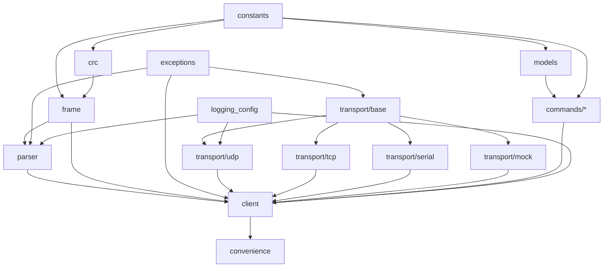

# SIYI SDK — Implementation Plan

## 1. Project Overview

This project delivers a modern, async Python SDK for the SIYI Gimbal Camera External SDK Protocol v0.1.1 (2025.02.26), covering the full binary framing layer (STX `0x6655`, CRC16/XMODEM, little-endian fields) and the complete command catalogue (≈75 CMD_IDs from `0x00` through `0x82`) across UART (TTL), UDP, and TCP transports. The SDK must be usable both as a library (imported by robotics/UAV applications integrating ZT30, ZT6, ZR10, ZR30, A8 mini, A2 mini, and Quad-Spectrum cameras) and as a diagnostic tool (hex-trace logging, frame replay).

**Target users**: UAV integrators on ArduPilot/PX4 companion computers, robotics researchers, and test engineers writing automated camera/gimbal test suites. Typical deployment: Linux companion computer (e.g., NVIDIA Jetson) connected to a SIYI link via Ethernet (UDP default) or TTL UART, often concurrently with a MAVLink stack.

**Design principles**:
- **Modularity** — Transport, framing, and command layers are independently replaceable (UDP/TCP/Serial/Mock all behind one `AbstractTransport`).
- **Testability** — Every protocol behaviour exercised against a `MockTransport` with byte-level fixtures taken directly from Chapter 4 "Communication Data Example" of the spec.
- **Type safety** — `mypy --strict`; `Annotated` types carry scale factors (e.g., `Annotated[int, Scale(0.1), Unit("deg")]`).
- **Protocol fidelity** — Constants and enum values match the spec byte-for-byte; no renaming, no reinterpretation.
- **Logging observability** — structlog JSON logs; `SIYI_PROTOCOL_TRACE=1` produces per-frame hex dumps without touching code.
- **Backwards compatibility** — SemVer; once a `SIYIClient.set_gimbal_attitude()` signature ships, it never silently changes meaning.

## 2. Repository Layout

```
siyi_sdk/
├── pyproject.toml
├── README.md
├── CHANGELOG.md
├── CONTRIBUTING.md
├── .pre-commit-config.yaml
├── .github/
│   └── workflows/
│       ├── ci.yml
│       └── release.yml
├── .claude/
│   └── agents/
├── siyi_sdk/
│   ├── __init__.py
│   ├── constants.py
│   ├── models.py
│   ├── exceptions.py
│   ├── logging_config.py
│   ├── convenience.py
│   ├── client.py
│   ├── protocol/
│   │   ├── __init__.py
│   │   ├── frame.py
│   │   ├── crc.py
│   │   └── parser.py
│   ├── transport/
│   │   ├── __init__.py
│   │   ├── base.py
│   │   ├── udp.py
│   │   ├── tcp.py
│   │   ├── serial.py
│   │   └── mock.py
│   └── commands/
│       ├── __init__.py
│       ├── system.py          # 0x00, 0x01, 0x02, 0x40, 0x80, 0x81, 0x82, 0x30, 0x31
│       ├── focus.py           # 0x04, 0x06
│       ├── zoom.py            # 0x05, 0x0F, 0x16, 0x18
│       ├── gimbal.py          # 0x07, 0x08, 0x0E, 0x19, 0x41
│       ├── attitude.py        # 0x0D, 0x22, 0x25, 0x26, 0x3E
│       ├── camera.py          # 0x0A, 0x0B, 0x0C, 0x20, 0x21, 0x48, 0x49, 0x4A, 0x4B, 0x4C
│       ├── video.py           # 0x10, 0x11
│       ├── thermal.py         # 0x12, 0x13, 0x14, 0x1A, 0x1B, 0x33, 0x34, 0x35,
│       │                      # 0x37, 0x38, 0x39, 0x3A, 0x3B, 0x3C,
│       │                      # 0x42-0x47, 0x4F
│       ├── laser.py           # 0x15, 0x17, 0x32
│       ├── rc.py              # 0x23, 0x24
│       ├── debug.py           # 0x27, 0x28, 0x29, 0x2A, 0x70, 0x71 (ArduPilot-only)
│       └── ai.py              # 0x4D, 0x4E, 0x50, 0x51
├── tests/
│   ├── __init__.py
│   ├── conftest.py
│   ├── test_constants.py
│   ├── test_models.py
│   ├── test_exceptions.py
│   ├── test_logging_config.py
│   ├── protocol/
│   │   ├── test_crc.py
│   │   ├── test_frame.py
│   │   └── test_parser.py
│   ├── transport/
│   │   ├── test_base.py
│   │   ├── test_udp.py
│   │   ├── test_tcp.py
│   │   ├── test_serial.py
│   │   └── test_mock.py
│   ├── commands/
│   │   ├── test_system.py
│   │   ├── test_focus.py
│   │   ├── test_zoom.py
│   │   ├── test_gimbal.py
│   │   ├── test_attitude.py
│   │   ├── test_camera.py
│   │   ├── test_video.py
│   │   ├── test_thermal.py
│   │   ├── test_laser.py
│   │   ├── test_rc.py
│   │   ├── test_debug.py
│   │   └── test_ai.py
│   ├── test_client.py
│   ├── test_convenience.py
│   ├── property/
│   │   ├── test_frame_roundtrip.py
│   │   └── test_parser_fuzz.py
│   └── hil/
│       ├── test_udp_live.py
│       └── test_serial_live.py
├── docs/
│   ├── index.md
│   ├── quickstart.md
│   ├── protocol.md
│   └── api/
├── examples/
│   ├── udp_heartbeat.py
│   ├── set_attitude.py
│   ├── subscribe_attitude_stream.py
│   ├── thermal_spot_temperature.py
│   └── laser_ranging.py
└── scripts/
    ├── dump_frame.py
    └── generate_crc_table.py
```

## 3. Architecture and Module Design

### `siyi_sdk/constants.py`
Responsibility: All protocol numeric literals named exactly as in the spec.
- `STX: Final[int] = 0x6655`
- `STX_BYTES: Final[bytes] = b"\x55\x66"` (little-endian on wire)
- `CTRL_NEED_ACK: Final[int] = 0`, `CTRL_ACK_PACK: Final[int] = 1`
- `HEADER_LEN: Final[int] = 8` (STX:2, CTRL:1, Data_len:2, SEQ:2, CMD_ID:1)
- `CRC_LEN: Final[int] = 2`
- `MIN_FRAME_LEN: Final[int] = HEADER_LEN + CRC_LEN  # 10`
- `SEQ_MAX: Final[int] = 0xFFFF`
- `CRC16_POLY: Final[int] = 0x1021  # X^16+X^12+X^5+1 (XMODEM)`
- `CRC16_INIT: Final[int] = 0x0000`
- Default transport endpoints: `DEFAULT_IP = "192.168.144.25"`, `DEFAULT_UDP_PORT = 37260`, `DEFAULT_TCP_PORT = 37260`, `DEFAULT_BAUD = 115200`
- Heartbeat literal frame: `HEARTBEAT_FRAME = bytes.fromhex("5566010100000000005 98B".replace(" ",""))`
- Camera startup grace: `CAMERA_BOOT_SECONDS = 30`
- Laser ranging: `LASER_MIN_M = 5`, `LASER_MAX_M = 1200`, `LASER_MIN_RAW_DM = 50`
- Every CMD_ID: `CMD_TCP_HEARTBEAT = 0x00`, `CMD_REQUEST_FIRMWARE_VERSION = 0x01`, `CMD_REQUEST_HARDWARE_ID = 0x02`, `CMD_AUTO_FOCUS = 0x04`, `CMD_MANUAL_ZOOM_AUTO_FOCUS = 0x05`, `CMD_MANUAL_FOCUS = 0x06`, `CMD_GIMBAL_ROTATION = 0x07`, `CMD_ONE_KEY_CENTERING = 0x08`, `CMD_REQUEST_CAMERA_SYSTEM_INFO = 0x0A`, `CMD_FUNCTION_FEEDBACK = 0x0B`, `CMD_CAPTURE_PHOTO_RECORD_VIDEO = 0x0C`, `CMD_REQUEST_GIMBAL_ATTITUDE = 0x0D`, `CMD_SET_GIMBAL_ATTITUDE = 0x0E`, `CMD_ABSOLUTE_ZOOM_AUTO_FOCUS = 0x0F`, `CMD_REQUEST_VIDEO_STITCHING_MODE = 0x10`, `CMD_SET_VIDEO_STITCHING_MODE = 0x11`, `CMD_GET_TEMP_AT_POINT = 0x12`, `CMD_LOCAL_TEMP_MEASUREMENT = 0x13`, `CMD_GLOBAL_TEMP_MEASUREMENT = 0x14`, `CMD_REQUEST_LASER_DISTANCE = 0x15`, `CMD_REQUEST_ZOOM_RANGE = 0x16`, `CMD_REQUEST_LASER_LATLON = 0x17`, `CMD_REQUEST_ZOOM_MAGNIFICATION = 0x18`, `CMD_REQUEST_GIMBAL_MODE = 0x19`, `CMD_REQUEST_PSEUDO_COLOR = 0x1A`, `CMD_SET_PSEUDO_COLOR = 0x1B`, `CMD_REQUEST_ENCODING_PARAMS = 0x20`, `CMD_SET_ENCODING_PARAMS = 0x21`, `CMD_SEND_AIRCRAFT_ATTITUDE = 0x22`, `CMD_SEND_RC_CHANNELS = 0x23`, `CMD_REQUEST_FC_DATA_STREAM = 0x24`, `CMD_REQUEST_GIMBAL_DATA_STREAM = 0x25`, `CMD_REQUEST_MAGNETIC_ENCODER = 0x26`, `CMD_REQUEST_CONTROL_MODE = 0x27`, `CMD_REQUEST_WEAK_THRESHOLD = 0x28`, `CMD_SET_WEAK_THRESHOLD = 0x29`, `CMD_REQUEST_MOTOR_VOLTAGE = 0x2A`, `CMD_SET_UTC_TIME = 0x30`, `CMD_REQUEST_GIMBAL_SYSTEM_INFO = 0x31`, `CMD_SET_LASER_RANGING_STATE = 0x32`, `CMD_REQUEST_THERMAL_OUTPUT_MODE = 0x33`, `CMD_SET_THERMAL_OUTPUT_MODE = 0x34`, `CMD_GET_SINGLE_TEMP_FRAME = 0x35`, `CMD_REQUEST_THERMAL_GAIN = 0x37`, `CMD_SET_THERMAL_GAIN = 0x38`, `CMD_REQUEST_ENV_CORRECTION_PARAMS = 0x39`, `CMD_SET_ENV_CORRECTION_PARAMS = 0x3A`, `CMD_REQUEST_ENV_CORRECTION_SWITCH = 0x3B`, `CMD_SET_ENV_CORRECTION_SWITCH = 0x3C`, `CMD_SEND_RAW_GPS = 0x3E`, `CMD_REQUEST_SYSTEM_TIME = 0x40`, `CMD_SINGLE_AXIS_ATTITUDE = 0x41`, `CMD_GET_IR_THRESH_MAP_STA = 0x42`, `CMD_SET_IR_THRESH_MAP_STA = 0x43`, `CMD_GET_IR_THRESH_PARAM = 0x44`, `CMD_SET_IR_THRESH_PARAM = 0x45`, `CMD_GET_IR_THRESH_PRECISION = 0x46`, `CMD_SET_IR_THRESH_PRECISION = 0x47`, `CMD_SD_FORMAT = 0x48`, `CMD_GET_PIC_NAME_TYPE = 0x49`, `CMD_SET_PIC_NAME_TYPE = 0x4A`, `CMD_GET_MAVLINK_OSD_FLAG = 0x4B`, `CMD_SET_MAVLINK_OSD_FLAG = 0x4C`, `CMD_GET_AI_MODE_STA = 0x4D`, `CMD_GET_AI_TRACK_STREAM_STA = 0x4E`, `CMD_MANUAL_THERMAL_SHUTTER = 0x4F`, `CMD_AI_TRACK_STREAM = 0x50`, `CMD_SET_AI_TRACK_STREAM_STA = 0x51`, `CMD_REQUEST_WEAK_CONTROL_MODE = 0x70`, `CMD_SET_WEAK_CONTROL_MODE = 0x71`, `CMD_SOFT_REBOOT = 0x80`, `CMD_GET_IP = 0x81`, `CMD_SET_IP = 0x82`.
- Hardware-ID first-byte product codes: `HW_ID_ZR10 = 0x6B`, `HW_ID_A8_MINI = 0x73`, `HW_ID_A2_MINI = 0x75`, `HW_ID_ZR30 = 0x78`, `HW_ID_QUAD_SPECTRUM = 0x7A`.
- `CRC16_TABLE: Final[tuple[int, ...]]` — the 256-entry lookup from Chapter 4 of the spec (exact values transcribed).

### `siyi_sdk/models.py`
Responsibility: Enumerations and dataclasses that mirror the protocol.
- `class ProductID(IntEnum)`: `ZR10=0x6B, A8_MINI=0x73, A2_MINI=0x75, ZR30=0x78, QUAD_SPECTRUM=0x7A`.
- `class GimbalMotionMode(IntEnum)`: `LOCK=0, FOLLOW=1, FPV=2`.
- `class MountingDirection(IntEnum)`: `RESERVED=0, NORMAL=1, INVERTED=2`.
- `class HDMICVBSOutput(IntEnum)`: `HDMI_ON_CVBS_OFF=0, HDMI_OFF_CVBS_ON=1`.
- `class RecordingState(IntEnum)`: `NOT_RECORDING=0, RECORDING=1, NO_TF_CARD=2, DATA_LOSS=3`.
- `class FunctionFeedback(IntEnum)`: `PHOTO_OK=0, PHOTO_FAILED=1, HDR_ON=2, HDR_OFF=3, RECORDING_FAILED=4, RECORDING_STARTED=5, RECORDING_STOPPED=6`.
- `class CaptureFuncType(IntEnum)`: `PHOTO=0, HDR_TOGGLE=1, START_RECORD=2, LOCK_MODE=3, FOLLOW_MODE=4, FPV_MODE=5, ENABLE_HDMI=6, ENABLE_CVBS=7, DISABLE_HDMI_CVBS=8, TILT_DOWNWARD=9, ZOOM_LINKAGE=10`.
- `class CenteringAction(IntEnum)`: `ONE_KEY_CENTER=1, CENTER_DOWNWARD=2, CENTER=3, DOWNWARD=4`.
- `class VideoEncType(IntEnum)`: `H264=1, H265=2`.
- `class StreamType(IntEnum)`: `RECORDING=0, MAIN=1, SUB=2`.
- `class VideoStitchingMode(IntEnum)` — 9 members `MODE_0..MODE_8` with semantic aliases per spec §0x10/0x11.
- `class PseudoColor(IntEnum)`: `WHITE_HOT=0, RESERVED=1, SEPIA=2, IRONBOW=3, RAINBOW=4, NIGHT=5, AURORA=6, RED_HOT=7, JUNGLE=8, MEDICAL=9, BLACK_HOT=10, GLORY_HOT=11`.
- `class TempMeasureFlag(IntEnum)`: `DISABLE=0, MEASURE_ONCE=1, CONTINUOUS_5HZ=2`.
- `class ThermalOutputMode(IntEnum)`: `FPS30=0, FPS25_PLUS_TEMP=1`.
- `class ThermalGain(IntEnum)`: `LOW=0, HIGH=1`.
- `class IRThreshPrecision(IntEnum)`: `MAX=1, MID=2, MIN=3`.
- `class FCDataType(IntEnum)`: `ATTITUDE=1, RC_CHANNELS=2`.
- `class GimbalDataType(IntEnum)`: `ATTITUDE=1, LASER_RANGE=2, MAGNETIC_ENCODER=3, MOTOR_VOLTAGE=4`.
- `class DataStreamFreq(IntEnum)`: `OFF=0, HZ2=1, HZ4=2, HZ5=3, HZ10=4, HZ20=5, HZ50=6, HZ100=7`.
- `class ControlMode(IntEnum)`: `ATTITUDE=0, WEAK=1, MIDDLE=2, FPV=3, MOTOR_CLOSE=4`.
- `class AITargetID(IntEnum)`: `HUMAN=0, CAR=1, BUS=2, TRUCK=3, ANY=255`.
- `class AITrackStatus(IntEnum)`: `NORMAL_AI=0, INTERMITTENT_LOSS=1, LOST=2, USER_CANCELED=3, NORMAL_ANY=4`.
- `class AIStreamStatus(IntEnum)`: `DISABLED=0, STREAMING=1, AI_NOT_ENABLED=2, TRACKING_NOT_ENABLED=3`.
- `class FileType(IntEnum)`: `PICTURE=0, TEMP_RAW=1, RECORD_VIDEO=2`.
- `class FileNameType(IntEnum)`: `RESERVE=0, INDEX=1, TIMESTAMP=2`.
- `class PicName(IntEnum)` (alias).
- Dataclasses (all `frozen=True, slots=True`):
  - `FirmwareVersion(camera: int, gimbal: int, zoom: int)` with `.as_tuple(byte: int) -> tuple[int,int,int]` decoder helper (divide one 32-bit word into major/minor/patch, discarding high byte per spec §0x01 note).
  - `HardwareID(raw: bytes)` with `.product_id -> ProductID`.
  - `CameraSystemInfo` (8 fields from §0x0A).
  - `GimbalAttitude(yaw_deg: float, pitch_deg: float, roll_deg: float, yaw_rate_dps: float, pitch_rate_dps: float, roll_rate_dps: float)` — raw/10 applied.
  - `SetAttitudeAck(yaw_deg: float, pitch_deg: float, roll_deg: float)`.
  - `AircraftAttitude(time_boot_ms: int, roll_rad: float, pitch_rad: float, yaw_rad: float, rollspeed: float, pitchspeed: float, yawspeed: float)`.
  - `RCChannels(chans: tuple[int, ...], chancount: int, rssi: int)`.
  - `EncodingParams(stream_type, enc_type, resolution_w, resolution_h, bitrate_kbps, frame_rate)`.
  - `TempPoint(x: int, y: int, temperature_c: float)`.
  - `TempRegion` (10-field rectangle from §0x13).
  - `TempGlobal` (6-field).
  - `EnvCorrectionParams(distance_m, emissivity_pct, humidity_pct, ambient_c, reflective_c)` — all values /100.
  - `LaserDistance(distance_m: float)` (raw dm / 10, `None` if raw==0).
  - `LaserTargetLatLon(lat_e7: int, lon_e7: int)`.
  - `ZoomRange(max_int: int, max_float: int)` → `max_zoom -> float`.
  - `CurrentZoom(integer: int, decimal: int)` → `.zoom -> float`.
  - `RawGPS(time_boot_ms, lat_e7, lon_e7, alt_msl_cm, alt_ellipsoid_cm, vn_mmps, ve_mmps, vd_mmps)`.
  - `MagneticEncoderAngles(yaw, pitch, roll)` (/10).
  - `MotorVoltage(yaw, pitch, roll)` (/1000, V).
  - `WeakControlThreshold(limit, voltage, angular_error)`.
  - `SystemTime(unix_usec: int, boot_ms: int)`.
  - `GimbalSystemInfo(laser_state: bool)`.
  - `IRThreshParams` (3 regions × switch/temp-range/color).
  - `AITrackingTarget(x, y, w, h, target_id: AITargetID, status: AITrackStatus)`.
  - `IPConfig(ip: IPv4Address, mask: IPv4Address, gateway: IPv4Address)`.
  - `AngleLimits(yaw_min: float, yaw_max: float, pitch_min: float, pitch_max: float)` + per-product table `ANGLE_LIMITS: dict[ProductID, AngleLimits]`.

### `siyi_sdk/exceptions.py`
```
SIYIError
├── ProtocolError
│   ├── FramingError              # bad STX, truncated
│   ├── CRCError(expected: int, actual: int, frame_hex: str)
│   ├── UnknownCommandError(cmd_id: int)
│   └── MalformedPayloadError(cmd_id: int, reason: str)
├── TransportError
│   ├── ConnectionError
│   ├── TimeoutError(cmd_id: int, timeout_s: float)
│   ├── SendError
│   └── NotConnectedError
├── CommandError
│   ├── NACKError(cmd_id: int, error_code: int, message: str)
│   ├── ResponseError(cmd_id: int, sta: int)   # sta==0 (per §0x04, 0x06, 0x07, 0x08, 0x21, 0x30)
│   └── UnsupportedByProductError(cmd_id: int, product: ProductID)
└── ConfigurationError                            # invalid angle, bad bitrate combo, etc.
```
Raised from: framing/CRC in `protocol/parser.py`; transport errors in `transport/*`; NACK/ResponseError in `client.py`/`commands/*`; ConfigurationError in `commands/*` for range checks (e.g., pitch > 25°, laser distance < 5 m).

### `siyi_sdk/logging_config.py`
structlog JSON logger factory.
- `get_logger(name: str) -> structlog.stdlib.BoundLogger`
- `configure_logging(level: str | None = None, trace: bool | None = None) -> None`
  - `SIYI_LOG_LEVEL` env (`DEBUG|INFO|WARNING|ERROR`, default `INFO`).
  - `SIYI_PROTOCOL_TRACE=1` forces level to DEBUG and binds `payload_hex` to every frame log record via a structlog processor.
- Processors: `add_log_level`, `TimeStamper(fmt="iso", utc=True)`, conditional `hexdump_processor`, `JSONRenderer()`.

### `siyi_sdk/protocol/frame.py`
```python
@dataclass(frozen=True, slots=True)
class Frame:
    ctrl: int
    seq: int
    cmd_id: int
    data: bytes

    @property
    def data_len(self) -> int: ...
    def to_bytes(self) -> bytes: ...
    @classmethod
    def from_bytes(cls, buf: bytes) -> "Frame": ...
    @classmethod
    def build(cls, cmd_id: int, data: bytes, seq: int, *, need_ack: bool = False) -> "Frame": ...
```
Imports: `.crc`, `..constants`, `..exceptions`.

### `siyi_sdk/protocol/crc.py`
```python
CRC16_TABLE: tuple[int, ...]  # re-exported from constants
def crc16(buf: bytes, init: int = CRC16_INIT) -> int: ...
def crc16_check(frame_without_crc: bytes, crc_le: bytes) -> bool: ...
```
Algorithm (per Chapter 4 "CRC16 Checksum"):
```
crc = init
for b in buf:
    temp = (crc >> 8) & 0xff
    crc = ((crc << 8) & 0xFFFF) ^ CRC16_TABLE[b ^ temp]
return crc
```
Poly `0x1021`, seed `0x0000`, no final XOR, no reflection (CRC-16/XMODEM). The CRC is appended little-endian to the frame.

**Test vectors** (from spec Chapter 4 examples — input is frame bytes excluding the 2-byte CRC):
1. Firmware req: `55 66 01 00 00 00 00 00 01` → CRC `0xC464` → bytes `64 C4`.
2. Hardware ID req: `55 66 01 00 00 00 00 00 02` → CRC `0xF407` → bytes `07 F4`.
3. Zoom +1: `55 66 01 01 00 00 00 00 05 01` → CRC `0x648D` → bytes `8D 64`.
4. Take Photo: `55 66 01 01 00 00 00 00 0C 00` → CRC `0xCE34` → bytes `34 CE`.
5. Heartbeat: `55 66 01 01 00 00 00 00 00` → CRC `0x8B59` → bytes `59 8B`.
6. Pan/Tilt 100,100: `55 66 01 02 00 00 00 00 07 64 64` → CRC `0xCF3D` → bytes `3D CF`.
7. One-Key Centering: `55 66 01 01 00 00 00 00 08 01` → CRC `0x12D1` → bytes `D1 12`.

### `siyi_sdk/protocol/parser.py`
Streaming SM. States: `AWAIT_STX1`, `AWAIT_STX2`, `READ_CTRL`, `READ_DATA_LEN_LO`, `READ_DATA_LEN_HI`, `READ_SEQ_LO`, `READ_SEQ_HI`, `READ_CMD_ID`, `READ_DATA`, `READ_CRC_LO`, `READ_CRC_HI`, `VERIFY_CRC`.
```python
class FrameParser:
    def __init__(self, max_payload: int = 4096) -> None: ...
    def feed(self, chunk: bytes) -> list[Frame]: ...
    def reset(self) -> None: ...
```
`Data_len > max_payload` → raise `FramingError` and resync on next `0x55`. CRC failure → `CRCError`, parser resyncs. Never throws on partial input.

### `siyi_sdk/transport/base.py`
```python
class AbstractTransport(ABC):
    @abstractmethod
    async def connect(self) -> None: ...
    @abstractmethod
    async def close(self) -> None: ...
    @abstractmethod
    async def send(self, data: bytes) -> None: ...
    @abstractmethod
    def stream(self) -> AsyncIterator[bytes]: ...
    @property
    @abstractmethod
    def is_connected(self) -> bool: ...
    @property
    @abstractmethod
    def supports_heartbeat(self) -> bool: ...   # TCP=True, UDP/Serial=False
```

### `siyi_sdk/transport/udp.py`
`UDPTransport(ip: str = DEFAULT_IP, port: int = DEFAULT_UDP_PORT, *, bind_port: int | None = None)` using `asyncio.DatagramProtocol`. `supports_heartbeat = False`.

### `siyi_sdk/transport/tcp.py`
`TCPTransport(ip: str = DEFAULT_IP, port: int = DEFAULT_TCP_PORT)` on `asyncio.open_connection`. `supports_heartbeat = True` — client sends literal `HEARTBEAT_FRAME` every 1 s (no ACK expected).

### `siyi_sdk/transport/serial.py`
`SerialTransport(device: str, baud: int = DEFAULT_BAUD)` built on `pyserial-asyncio` (8-N-1). `supports_heartbeat = False`.

### `siyi_sdk/transport/mock.py`
```python
class MockTransport(AbstractTransport):
    def __init__(self) -> None: ...
    def queue_response(self, data: bytes) -> None: ...
    def queue_error(self, exc: Exception) -> None: ...
    @property
    def sent_frames(self) -> list[bytes]: ...
```
Deterministic for tests; `queue_response` bytes are delivered on the next `stream()` tick.

### `siyi_sdk/commands/*.py`
Each module exposes pure encode/decode helpers used by `client.py`:
```python
# commands/gimbal.py
def encode_rotation(yaw: int, pitch: int) -> bytes: ...
def decode_rotation_ack(payload: bytes) -> None: ...    # raises ResponseError on sta==0
def encode_set_attitude(yaw_deciDeg: int, pitch_deciDeg: int) -> bytes: ...
def decode_set_attitude_ack(payload: bytes) -> SetAttitudeAck: ...
def encode_one_key_centering(action: CenteringAction) -> bytes: ...
def decode_request_gimbal_mode(payload: bytes) -> GimbalMotionMode: ...
def encode_single_axis(angle_deciDeg: int, axis: int) -> bytes: ...
```
All encoders validate ranges (e.g., `gimbal.encode_rotation` enforces `-100 ≤ yaw ≤ 100`). Every decoder returns a typed model or raises.

### `siyi_sdk/client.py`
```python
class SIYIClient:
    def __init__(self, transport: AbstractTransport, *, default_timeout: float = 1.0, logger: BoundLogger | None = None) -> None: ...
    async def __aenter__(self) -> "SIYIClient": ...
    async def __aexit__(self, *exc_info: object) -> None: ...
    async def connect(self) -> None: ...
    async def close(self) -> None: ...

    # System (0x00, 0x01, 0x02, 0x40, 0x30, 0x31, 0x80, 0x81, 0x82)
    async def heartbeat(self) -> None: ...
    async def get_firmware_version(self) -> FirmwareVersion: ...
    async def get_hardware_id(self) -> HardwareID: ...
    async def get_system_time(self) -> SystemTime: ...
    async def set_utc_time(self, unix_usec: int) -> bool: ...
    async def get_gimbal_system_info(self) -> GimbalSystemInfo: ...
    async def soft_reboot(self, *, camera: bool = False, gimbal: bool = False) -> tuple[bool, bool]: ...
    async def get_ip_config(self) -> IPConfig: ...
    async def set_ip_config(self, cfg: IPConfig) -> None: ...

    # Focus / Zoom (0x04, 0x05, 0x06, 0x0F, 0x16, 0x18)
    async def auto_focus(self, touch_x: int, touch_y: int) -> None: ...
    async def manual_zoom(self, direction: int) -> float: ...
    async def manual_focus(self, direction: int) -> None: ...
    async def absolute_zoom(self, zoom: float) -> None: ...
    async def get_zoom_range(self) -> ZoomRange: ...
    async def get_current_zoom(self) -> float: ...

    # Gimbal (0x07, 0x08, 0x0E, 0x19, 0x41)
    async def rotate(self, yaw: int, pitch: int) -> None: ...
    async def one_key_centering(self, action: CenteringAction = CenteringAction.CENTER) -> None: ...
    async def set_attitude(self, yaw_deg: float, pitch_deg: float) -> SetAttitudeAck: ...
    async def set_single_axis(self, axis: Literal["yaw","pitch"], angle_deg: float) -> SetAttitudeAck: ...
    async def get_gimbal_mode(self) -> GimbalMotionMode: ...

    # Attitude / Streams (0x0D, 0x22, 0x24, 0x25, 0x26, 0x3E)
    async def get_gimbal_attitude(self) -> GimbalAttitude: ...
    async def send_aircraft_attitude(self, att: AircraftAttitude) -> None: ...
    async def request_fc_stream(self, data_type: FCDataType, freq: DataStreamFreq) -> None: ...
    async def request_gimbal_stream(self, data_type: GimbalDataType, freq: DataStreamFreq) -> None: ...
    async def get_magnetic_encoder(self) -> MagneticEncoderAngles: ...
    async def send_raw_gps(self, gps: RawGPS) -> None: ...
    def on_attitude(self, cb: Callable[[GimbalAttitude], None]) -> Unsubscribe: ...
    def on_laser_distance(self, cb: Callable[[LaserDistance], None]) -> Unsubscribe: ...

    # Camera (0x0A, 0x0B, 0x0C, 0x20, 0x21, 0x48, 0x49, 0x4A, 0x4B, 0x4C)
    async def get_camera_system_info(self) -> CameraSystemInfo: ...
    async def on_function_feedback(self, cb: Callable[[FunctionFeedback], None]) -> Unsubscribe: ...
    async def capture(self, func: CaptureFuncType) -> None: ...
    async def get_encoding_params(self, stream: StreamType) -> EncodingParams: ...
    async def set_encoding_params(self, params: EncodingParams) -> bool: ...
    async def format_sd_card(self) -> bool: ...
    async def get_picture_name_type(self, ft: FileType) -> FileNameType: ...
    async def set_picture_name_type(self, ft: FileType, nt: FileNameType) -> None: ...
    async def get_osd_flag(self) -> bool: ...
    async def set_osd_flag(self, on: bool) -> bool: ...

    # Video stitching (0x10, 0x11)
    async def get_video_stitching_mode(self) -> VideoStitchingMode: ...
    async def set_video_stitching_mode(self, mode: VideoStitchingMode) -> VideoStitchingMode: ...

    # Thermal (0x12-0x14, 0x1A, 0x1B, 0x33-0x3C, 0x42-0x47, 0x4F)
    async def temp_at_point(self, x: int, y: int, flag: TempMeasureFlag) -> TempPoint: ...
    async def temp_region(self, region: tuple[int,int,int,int], flag: TempMeasureFlag) -> TempRegion: ...
    async def temp_global(self, flag: TempMeasureFlag) -> TempGlobal: ...
    async def get_pseudo_color(self) -> PseudoColor: ...
    async def set_pseudo_color(self, c: PseudoColor) -> PseudoColor: ...
    async def get_thermal_output_mode(self) -> ThermalOutputMode: ...
    async def set_thermal_output_mode(self, m: ThermalOutputMode) -> ThermalOutputMode: ...
    async def get_single_temp_frame(self) -> bool: ...
    async def get_thermal_gain(self) -> ThermalGain: ...
    async def set_thermal_gain(self, g: ThermalGain) -> ThermalGain: ...
    async def get_env_correction_params(self) -> EnvCorrectionParams: ...
    async def set_env_correction_params(self, p: EnvCorrectionParams) -> bool: ...
    async def get_env_correction_switch(self) -> bool: ...
    async def set_env_correction_switch(self, on: bool) -> bool: ...
    async def get_ir_thresh_map_state(self) -> bool: ...
    async def set_ir_thresh_map_state(self, on: bool) -> bool: ...
    async def get_ir_thresh_params(self) -> IRThreshParams: ...
    async def set_ir_thresh_params(self, p: IRThreshParams) -> bool: ...
    async def get_ir_thresh_precision(self) -> IRThreshPrecision: ...
    async def set_ir_thresh_precision(self, p: IRThreshPrecision) -> IRThreshPrecision: ...
    async def manual_thermal_shutter(self) -> bool: ...

    # Laser (0x15, 0x17, 0x32)
    async def get_laser_distance(self) -> LaserDistance: ...
    async def get_laser_target_latlon(self) -> LaserTargetLatLon: ...
    async def set_laser_ranging_state(self, on: bool) -> bool: ...

    # RC (0x23, 0x24)
    async def send_rc_channels(self, ch: RCChannels) -> None: ...

    # AI (0x4D, 0x4E, 0x50, 0x51)
    async def get_ai_mode(self) -> bool: ...
    async def get_ai_stream_status(self) -> AIStreamStatus: ...
    async def set_ai_stream_output(self, on: bool) -> bool: ...
    def on_ai_tracking(self, cb: Callable[[AITrackingTarget], None]) -> Unsubscribe: ...

    # Debug (ArduPilot-only: 0x27, 0x28, 0x29, 0x2A, 0x70, 0x71)
    async def get_control_mode(self) -> ControlMode: ...
    async def get_weak_threshold(self) -> WeakControlThreshold: ...
    async def set_weak_threshold(self, t: WeakControlThreshold) -> bool: ...
    async def get_motor_voltage(self) -> MotorVoltage: ...
    async def get_weak_control_mode(self) -> bool: ...
    async def set_weak_control_mode(self, on: bool) -> bool: ...
```
Imports: every module listed above.

### `siyi_sdk/convenience.py`
```python
async def connect_udp(ip: str = DEFAULT_IP, port: int = DEFAULT_UDP_PORT, *, timeout: float = 1.0) -> SIYIClient: ...
async def connect_tcp(ip: str = DEFAULT_IP, port: int = DEFAULT_TCP_PORT) -> SIYIClient: ...
async def connect_serial(device: str, baud: int = 115200) -> SIYIClient: ...
```

### Dependency graph



## 4. Communication Layer Design

- **Async strategy**: `asyncio`. Rationale: the protocol has asynchronous streams (attitude at 2–100 Hz via `0x25`, function-feedback push, AI tracking push via `0x50`) overlapping with synchronous request/ACK commands; asyncio lets one coroutine own the socket while per-command futures wait on matching responses. Thread-based alternatives would require explicit dispatch locks and duplicate the work.
- **Sequence number**: `uint16` per spec field `SEQ`, range 0–65535. Client holds an `itertools.count() % 65536` incrementer. Wrap from 0xFFFF → 0x0000 silently (the spec gives no reset rule; this matches the only documented constraint of the field width). For commands the spec's examples send SEQ=0; we will actively increment (safe because the gimbal's ACK echoes CMD_ID not SEQ, but distinct SEQs aid log correlation).
- **Pending-response registry**: `dict[int, asyncio.Future]` keyed by `cmd_id` (the protocol does not tag ACKs by SEQ). Per-cmd_id exclusive — client acquires an `asyncio.Lock` per CMD_ID to serialise outstanding requests with the same ID. Timeout policy: `asyncio.wait_for(fut, timeout=default_timeout)` → on expiry raise `TimeoutError(cmd_id, timeout_s)` and remove the future.
- **Receive loop**: single coroutine `_reader()` iterates `transport.stream()`; each chunk → `FrameParser.feed(chunk)` → list of `Frame`. For each frame: if CMD_ID has a pending future, set result; if CMD_ID is a stream push (`0x0D`, `0x15`, `0x26`, `0x2A`, `0x0B`, `0x50`), dispatch to subscribers; otherwise log `unexpected_frame` at WARNING.
- **Heartbeat task**: coroutine `_heartbeat()` (started only when `transport.supports_heartbeat`) sends the literal `HEARTBEAT_FRAME` every 1 s. Cancelled in `close()` via `task.cancel()` and awaited with `CancelledError` suppressed.
- **Reconnection policy**: Optional, opt-in via `SIYIClient(auto_reconnect=True)`. Exponential back-off 0.5 s, 1 s, 2 s, 4 s, 8 s (max); 5 attempts then raise `ConnectionError`. On reconnect, re-issue any active `request_*_stream` subscriptions. Emits `reconnected` / `reconnect_failed` events via an `asyncio.Event` exposed as `client.connection_event`.

## 5. Exception Hierarchy

```
SIYIError (base)
├── ProtocolError
│   ├── FramingError                     # raised in parser.py on bad STX / truncation; carries state + last 32 bytes of buffer
│   ├── CRCError(expected, actual, frame_hex)   # parser.py
│   ├── UnknownCommandError(cmd_id)      # client._reader() when ACK CMD_ID is unknown
│   └── MalformedPayloadError(cmd_id, reason)  # commands/*.decode_* on wrong payload size
├── TransportError
│   ├── ConnectionError                  # transport/*.connect() failure
│   ├── TimeoutError(cmd_id, timeout_s)  # client.py wait_for expiry
│   ├── SendError                        # transport/*.send() OS errors
│   └── NotConnectedError                # client.py sending before connect()
├── CommandError
│   ├── NACKError(cmd_id, error_code, message)   # reserved for future-spec NACK frames
│   ├── ResponseError(cmd_id, sta)       # commands/* when `sta==0` from 0x04/0x06/0x07/0x08/0x21/0x30/0x32/0x3A/0x45/0x82
│   └── UnsupportedByProductError(cmd_id, product)  # raised against Appendix 1/2 support table
└── ConfigurationError                   # range/validation failures in encoders (yaw out of range, zoom<0.1x, etc.)
```
Context carried: every exception subclass is a `@dataclass` so `repr()` shows fields; every exception logs once at `ERROR` with `cmd_id` bound.

## 6. Logging Strategy

- **DEBUG**: every frame TX/RX with `direction`, `cmd_id`, `seq_num`, `payload_len`, `ctrl`. Per-frame `payload_hex` only when `SIYI_PROTOCOL_TRACE=1`.
- **INFO**: connection lifecycle (`connected`, `disconnected`, `reconnected`), subscription changes, high-level command completions for non-idempotent ops (`set_ip_config`, `format_sd_card`, `soft_reboot`).
- **WARNING**: unexpected frames (unknown cmd_id, no pending future), retry attempts, stream gaps > 2× expected interval.
- **ERROR**: CRC failures, framing errors, transport send/recv errors, NACK/ResponseError, timeouts.
- **Structured fields on every record**: `timestamp` (ISO-8601 UTC), `logger`, `level`, `direction` (`tx`/`rx`/`-`), `cmd_id` (`"0x0E"` hex string), `seq_num` (int), `payload_len` (int), `transport` (`udp|tcp|serial|mock`), `peer` (`ip:port` or device). When `SIYI_PROTOCOL_TRACE=1`: add `payload_hex` (space-separated lowercase) and raise level to DEBUG.
- **Hex-dump activation**: `configure_logging()` reads `SIYI_PROTOCOL_TRACE`; if `=1`, installs `hexdump_processor` which reads bound `payload_bytes` and emits `payload_hex`. Zero code changes at call sites — the processor runs unconditionally but is a no-op when the env var is unset.

## 7. Testing Strategy

- **Unit layer** (`tests/` not under `property/` or `hil/`): pure-function tests for `crc.py`, `frame.py`, `parser.py`, every `commands/*.py` encoder/decoder. Byte-exact fixtures copied from Chapter 4 of the spec.
- **Integration layer**: `test_client.py` wires `SIYIClient` to `MockTransport`, queueing realistic ACK bytes and asserting dispatch, timeouts, and stream subscriptions.
- **Property-based** (`tests/property/`):
  - `test_frame_roundtrip.py` — hypothesis strategy for `(cmd_id, data, seq, ctrl)`; round-trip `Frame.build(...).to_bytes()` → `FrameParser.feed(...)`; invariant: one frame emitted, fields preserved.
  - `test_parser_fuzz.py` — feed random byte streams in arbitrary chunk sizes; invariant: no uncaught exceptions, parser always resyncs on STX.
- **Hardware-in-the-loop** (`tests/hil/`, opt-in via `pytest -m hil`): talk to a real A8 mini or ZR10 on `192.168.144.25:37260`. Skipped in CI.
- **Mock strategy**: `MockTransport.queue_response(bytes)` pre-loads the reader queue. `queue_error(Exception)` injects OS-level failures. `sent_frames` asserts byte-exact output.
- **Coverage targets**:
  - `protocol/crc.py` — 100% branch (tiny module, 7 fixture vectors + property test).
  - `protocol/frame.py` — 100% line, 95% branch.
  - `protocol/parser.py` — 100% state-machine transitions, 95% branch.
  - `commands/*.py` — 100% encode/decode line coverage; every enum member round-tripped.
  - `transport/mock.py` — 100%. `transport/udp.py`, `tcp.py`, `serial.py` — 80% (OS-dependent branches skipped).
  - `client.py` — 90% line, 85% branch; every public async method has at least one happy-path and one timeout test.
- **Test modules** (one-line summary each):
  - `test_constants.py` — every CMD_ID has a unique value; `CRC16_TABLE` has 256 entries; heartbeat frame CRC verifies.
  - `test_models.py` — enum values match spec integers; dataclass `__slots__` set; `ProductID(0x6B).name == "ZR10"`.
  - `test_exceptions.py` — hierarchy, field preservation, `repr()` formatting.
  - `test_logging_config.py` — env-var parsing, hex-dump processor on/off, JSON output validity.
  - `protocol/test_crc.py` — 7 fixture vectors from §4; `crc16(b"")==0`; property test (monotonic length effect).
  - `protocol/test_frame.py` — encode Chapter-4 examples byte-exactly; decode them; `build(seq=N)` round-trips.
  - `protocol/test_parser.py` — chunked feeding, STX mid-stream resync, CRC failure, oversized Data_len rejection.
  - `transport/test_base.py` — ABC contract.
  - `transport/test_udp.py` — send/recv loop against a throwaway socket.
  - `transport/test_tcp.py` — heartbeat scheduling, graceful shutdown.
  - `transport/test_serial.py` — uses `pyserial` loopback.
  - `transport/test_mock.py` — FIFO semantics, error injection.
  - `commands/test_system.py` — fw/hw-ID decoding (raw `0x6E030203 → v3.2.3`), soft reboot flags.
  - `commands/test_focus.py` — auto_focus range validation, manual_focus directions {-1,0,1}.
  - `commands/test_zoom.py` — abs_zoom int part 1..0x1E, decimal 0..9; `manual_zoom` ACK divided by 10.
  - `commands/test_gimbal.py` — yaw/pitch clamp −100..100; set_attitude deciDegrees round-trip; per-product angle limits (ZR30 yaw ±270°).
  - `commands/test_attitude.py` — `int16/10` conversion for all six attitude fields; raw-GPS scaling.
  - `commands/test_camera.py` — capture fn_type range; encoding params 1920×1080 H265 round-trip vs spec byte example.
  - `commands/test_video.py` — all 9 stitching modes.
  - `commands/test_thermal.py` — `/100` conversion for all temperature fields, all 12 pseudo-colours (Reserved=1 allowed).
  - `commands/test_laser.py` — 5 m–1200 m valid, <5 or >1200 → raw 0 → `distance_m is None`.
  - `commands/test_rc.py` — 18 channels + rssi encoding.
  - `commands/test_debug.py` — `/10` and `/1000` scalings.
  - `commands/test_ai.py` — target ID 0..3, 255, status 0..4.
  - `test_client.py` — dispatch, timeouts, sequence increment, heartbeat only on TCP, stream subscription (0x25 attitude), unsubscribe.
  - `test_convenience.py` — factory happy-path with `MockTransport`.
- **Hypothesis targets**: `Frame.build` round-trip; `FrameParser` fuzz; CRC equivalence between table and reference bit-by-bit implementation; attitude-scale (int16 ↔ degrees) round-trip.

## 8. Versioning and Release

- **SemVer**: MAJOR when a public `SIYIClient` signature or wire behaviour breaks; MINOR for new commands, new transports, new enum members; PATCH for bugfixes and doc.
- **CHANGELOG.md**: Keep a Changelog 1.1.0 format, sections `Added / Changed / Deprecated / Removed / Fixed / Security`, `[Unreleased]` at top.
- **Git tags**: `vMAJOR.MINOR.PATCH`; annotated, GPG-signed.
- **GitHub Actions `.github/workflows/ci.yml`**: on push/PR — matrix py3.10/3.11/3.12/3.13, Ubuntu. Jobs (fail-fast): `lint` (ruff + black check) → `typecheck` (mypy --strict) → `test` (pytest with coverage, fail <90%) → `build` (`hatch build`). All run in parallel where possible.
- **`release.yml`**: on tag `v*.*.*` — `build` → `publish` to PyPI via `pypa/gh-action-pypi-publish` OIDC, then GitHub Release with the matching CHANGELOG section.
- **Tooling**: `hatch` as the build/env manager, `uv` as the lockfile resolver (`uv lock`). Pre-commit: ruff, black, mypy, end-of-file-fixer.

## 9. Engineering Task List

### Phase 0 — Scaffolding
- [ ] TASK-001: Create `pyproject.toml` with hatch build-system, project metadata, and dependency pins from §10 — AC: `hatch env create && hatch run python -c "import siyi_sdk"` succeeds on empty package.
- [ ] TASK-002: Add `ruff` + `black` config in `pyproject.toml`, line-length 100, target-version py310 — AC: `hatch run lint` exits 0 on empty package.
- [ ] TASK-003: Add `mypy --strict` config (strict=True, warn_unreachable, disallow_any_generics) — AC: `hatch run typecheck` exits 0 on empty package.
- [ ] TASK-004: Add `.pre-commit-config.yaml` (ruff, black, mypy, trailing-whitespace, end-of-file-fixer) and `CONTRIBUTING.md` — AC: `pre-commit run --all-files` green.
- [ ] TASK-005: Create empty `siyi_sdk/__init__.py` declaring `__version__ = "0.0.0"` and empty sub-packages (`protocol/`, `transport/`, `commands/`) with `__init__.py` — AC: `python -c "import siyi_sdk.protocol, siyi_sdk.transport, siyi_sdk.commands"` succeeds.
- [ ] TASK-006: Mirror empty package structure under `tests/` with `__init__.py` files and `conftest.py` placeholder — AC: `pytest --collect-only` runs with 0 errors.
- [ ] TASK-007: Add `.github/workflows/ci.yml` (lint → typecheck → test → build) — AC: CI green on the scaffolded repo.
- [ ] TASK-008: Add `.github/workflows/release.yml` (PyPI publish on `v*` tag) — AC: dry-run (`act` or manual trigger) builds artifact.
- [ ] TASK-009: Initial `CHANGELOG.md` (`[0.0.1] - YYYY-MM-DD — Added: scaffolding`) and `README.md` skeleton — AC: both files present, CHANGELOG passes Keep-a-Changelog linter.

### Phase 1 — Protocol Foundation
- [ ] TASK-010: Implement `siyi_sdk/constants.py` with every CMD_ID, STX, CTRL flags, endpoint defaults, CRC poly/init, hardware IDs, angle limits, and the 256-entry `CRC16_TABLE` literal from Chapter 4 — AC: mypy strict passes, no magic hex literals appear in any other module (enforced by a ruff custom rule or grep test).
- [ ] TASK-011: Implement `siyi_sdk/models.py` with all enumerations and dataclasses listed in §3 — AC: every enum member matches the spec integer; `pytest tests/test_models.py` green.
- [ ] TASK-012: Implement `siyi_sdk/exceptions.py` exception hierarchy per §5 — AC: `isinstance(CRCError(0,1,"55"), ProtocolError)` and `SIYIError`; tests green.
- [ ] TASK-013: Implement `siyi_sdk/protocol/crc.py` with `crc16()` per spec algorithm — AC: all 7 fixture vectors from §Appendix D match, `crc16(b"")==0`.
- [ ] TASK-014: Implement `siyi_sdk/protocol/frame.py` with `Frame.to_bytes/from_bytes/build` — AC: Chapter-4 examples (zoom+1, take-photo, heartbeat, pan-tilt, one-key-centering, firmware-req, hw-id-req) round-trip byte-exactly.
- [ ] TASK-015: Implement `siyi_sdk/protocol/parser.py` streaming state machine — AC: feeding any Chapter-4 example in 1-byte chunks yields exactly one `Frame`; injecting one bad byte mid-frame yields `CRCError` and resync.
- [ ] TASK-016: Add hypothesis tests in `tests/property/test_frame_roundtrip.py` and `test_parser_fuzz.py` — AC: 1000+ examples each pass; parser never throws on arbitrary bytes (only returns `[]` or raises documented errors).
- [ ] TASK-017: Implement `siyi_sdk/logging_config.py` with `configure_logging()` and hex-dump processor — AC: with `SIYI_PROTOCOL_TRACE=1` a TX frame log contains `payload_hex`; without it, does not.

### Phase 2 — Transport Layer
- [ ] TASK-020: Implement `siyi_sdk/transport/base.py` `AbstractTransport` ABC and `Unsubscribe` type alias — AC: `mypy --strict` passes; `isinstance` check works.
- [ ] TASK-021: Implement `siyi_sdk/transport/mock.py` `MockTransport` — AC: queued bytes stream in FIFO order; `sent_frames` captures every `send()`.
- [ ] TASK-022: Implement `siyi_sdk/transport/udp.py` `UDPTransport` on `asyncio.DatagramProtocol` — AC: round-trip against a loopback UDP echo server.
- [ ] TASK-023: Implement `siyi_sdk/transport/tcp.py` `TCPTransport` (`supports_heartbeat=True`) — AC: round-trip against `asyncio.start_server`.
- [ ] TASK-024: Implement `siyi_sdk/transport/serial.py` `SerialTransport` using `pyserial-asyncio` — AC: round-trip on a `socat` pty pair.
- [ ] TASK-025: Write `tests/transport/test_*.py` for all four transports — AC: 80% coverage on real transports, 100% on mock.

### Phase 3 — Command Layer
- [ ] TASK-030: Implement `commands/system.py` (0x00, 0x01, 0x02, 0x30, 0x31, 0x40, 0x80, 0x81, 0x82) — AC: fw decode of `0x6E030203 → FirmwareVersion(*, *, *)` equals `v3.2.3` (low 3 bytes); Chapter-4 Retrieve-Firmware-Version example byte-exactly encoded.
- [ ] TASK-031: Implement `commands/focus.py` (0x04, 0x06) — AC: `auto_focus(1, 300, 100)` encodes to `04 01 2C 01 64 00` payload matching Chapter 4 example.
- [ ] TASK-032: Implement `commands/zoom.py` (0x05, 0x0F, 0x16, 0x18) — AC: `absolute_zoom(4.5)` encodes to `0F 04 05` matching Chapter 4 example; `current_zoom` decode returns `1.0` for `{01, 00}`.
- [ ] TASK-033: Implement `commands/gimbal.py` (0x07, 0x08, 0x0E, 0x19, 0x41) — AC: `rotate(100,100)` matches Chapter-4 `07 64 64`; `set_attitude(-90.0, 0.0)` encodes pitch field = `0xFC7C` (−900 int16 LE).
- [ ] TASK-034: Implement `commands/attitude.py` (0x0D, 0x22, 0x24, 0x25, 0x26, 0x3E) — AC: `GimbalAttitude` decoder divides raw int16 by 10; Chapter-4 GPS example round-trips.
- [ ] TASK-035: Implement `commands/camera.py` (0x0A, 0x0B, 0x0C, 0x20, 0x21, 0x48, 0x49, 0x4A, 0x4B, 0x4C) — AC: Chapter-4 "Set Camera Encoding Params Main Stream HD H.265 1.5M" fixture encodes byte-exactly.
- [ ] TASK-036: Implement `commands/video.py` (0x10, 0x11) — AC: all 9 stitching modes enum round-trip.
- [ ] TASK-037: Implement `commands/thermal.py` (0x12–0x14, 0x1A, 0x1B, 0x33–0x3C, 0x42–0x47, 0x4F) — AC: `temp_at_point` divides raw /100; all 12 pseudo-colours round-trip.
- [ ] TASK-038: Implement `commands/laser.py` (0x15, 0x17, 0x32) — AC: raw 0 → `LaserDistance(None)`; raw 100 → 10.0 m; raw below 50 → `None` per spec.
- [ ] TASK-039: Implement `commands/rc.py` (0x23, 0x24) — AC: 18 channels + chancount + rssi pack into 20+2 bytes correctly.
- [ ] TASK-040: Implement `commands/debug.py` (0x27–0x2A, 0x70, 0x71) — AC: motor voltage /1000 conversion; threshold /10 conversion.
- [ ] TASK-041: Implement `commands/ai.py` (0x4D, 0x4E, 0x50, 0x51) — AC: AI tracking stream decode matches §0x50 structure; `AITargetID(255).name == "ANY"`.

### Phase 4 — High-Level Client
- [ ] TASK-050: Implement `siyi_sdk/client.py` `SIYIClient.__init__`, `connect`, `close`, `__aenter__/__aexit__` — AC: context-manager usage with `MockTransport` opens and closes without leaks.
- [ ] TASK-051: Implement `_reader()` receive loop and per-CMD_ID pending-future registry with timeouts — AC: two concurrent `get_firmware_version()` calls serialise correctly via per-CMD_ID lock; timeout raises `TimeoutError(cmd_id, timeout_s)`.
- [ ] TASK-052: Implement `_heartbeat()` task, started only when `transport.supports_heartbeat` — AC: over 3 s with TCP transport, exactly 3 heartbeat frames appear in `MockTransport.sent_frames`; with UDP, 0 appear.
- [ ] TASK-053: Implement sequence-number incrementer with 0xFFFF wrap — AC: property test — sending 70 000 frames yields 70 000 unique SEQ modulo 65 536.
- [ ] TASK-054: Wire every `SIYIClient` method listed in §3 to its `commands/*` encoder/decoder — AC: each method has a passing happy-path test in `tests/test_client.py`.
- [ ] TASK-055: Implement stream-subscription API (`on_attitude`, `on_function_feedback`, `on_laser_distance`, `on_ai_tracking`) with `Unsubscribe` returns — AC: subscribing, receiving 5 pushed frames, then unsubscribing → no further callbacks.
- [ ] TASK-056: Implement optional auto-reconnect with back-off 0.5/1/2/4/8 s, max 5 attempts — AC: killing the mock transport triggers reconnect; stream subscriptions survive.
- [ ] TASK-057: Implement `siyi_sdk/convenience.py` factory helpers — AC: `connect_udp()` returns a connected `SIYIClient`.

### Phase 5 — Tests and QA
- [ ] TASK-060: Integration test suite against Chapter-4 byte fixtures covering every command in §11.B — AC: all fixtures pass; coverage report ≥ 90%.
- [ ] TASK-061: Hypothesis fuzz for parser and frame round-trip hits 10 000 examples in CI — AC: CI job "property" green, runtime < 60 s.
- [ ] TASK-062: HIL scaffolding: `tests/hil/test_udp_live.py` with env-gated real-device checks (ping 192.168.144.25, get fw version, get attitude, stop) — AC: passes on developer hardware; `pytest -m "not hil"` skips it.
- [ ] TASK-063: Benchmark parser throughput on a 10 MB random blob — AC: ≥ 50 MB/s on Linux x86_64 CI runner; results stored in `tests/benchmarks/results.json`.

### Phase 6 — Docs and Release
- [ ] TASK-070: Write `docs/quickstart.md` (UDP + TCP + Serial examples) — AC: every code snippet executes against `MockTransport` in a doctest.
- [ ] TASK-071: Write `docs/protocol.md` mirroring Appendix A/B/D/E of this plan — AC: link-checker green; all CMD_IDs covered.
- [ ] TASK-072: Add `examples/udp_heartbeat.py`, `examples/set_attitude.py`, `examples/subscribe_attitude_stream.py`, `examples/thermal_spot_temperature.py`, `examples/laser_ranging.py` — AC: each runs against `MockTransport` under `pytest --collect-only examples/`.
- [ ] TASK-073: Publish v0.1.0 — tag `v0.1.0`, CHANGELOG updated, GitHub Release + PyPI publish via workflow — AC: `pip install siyi-sdk==0.1.0` succeeds on a clean venv.

## 10. Dependency Table

Runtime:

| Package | Version pin | Purpose | Licence |
|---------|-------------|---------|---------|
| structlog | >=24.0,<26 | Structured JSON logging | MIT |
| pyserial-asyncio | >=0.6,<1 | Serial/UART transport | BSD-3-Clause |
| typing-extensions | >=4.10 | `Annotated`, `Self`, `override` on py310/311 | PSF |

Dev:

| Package | Version pin | Purpose | Licence |
|---------|-------------|---------|---------|
| pytest | >=8,<9 | Test runner | MIT |
| pytest-asyncio | >=0.23,<1 | async test support | Apache-2.0 |
| pytest-cov | >=5,<6 | Coverage | MIT |
| hypothesis | >=6.100,<7 | Property-based testing | MPL-2.0 |
| mypy | >=1.10,<2 | Static type checking | MIT |
| ruff | >=0.5,<1 | Lint | MIT |
| black | >=24.3,<26 | Format | MIT |
| hatch | >=1.12,<2 | Build/env manager | MIT |
| uv | >=0.4 | Lockfile resolver | Apache-2.0/MIT |
| pre-commit | >=3.7,<5 | Git hooks | MIT |

## 11. Protocol Reference Appendix

### A. Frame Structure

```
Offset  Bytes  Field     Type     Endianness  Valid values
------  -----  --------  -------  ----------  -----------------------------------
0       2      STX       uint16   LE          0x6655 (wire bytes: 0x55 0x66)
2       1      CTRL      uint8    -           bit0=need_ack, bit1=ack_pack, 2..7 reserved
3       2      Data_len  uint16   LE          0 .. 65 535 (payload length in bytes)
5       2      SEQ       uint16   LE          0 .. 65 535 (wraps)
7       1      CMD_ID    uint8    -           see §B
8       N      DATA      bytes    -           N = Data_len
8+N     2      CRC16     uint16   LE          CRC-16/XMODEM over bytes 0 .. 7+N
```
Minimum frame length: 10 bytes (empty payload). CTRL=0 means "request requiring ACK"; CTRL=1 means "this is the ACK". Bits 2–7 reserved, must be 0.

### B. Complete Command Catalogue

| CMD_ID | Name | Dir | Request payload | ACK payload | Notes |
|--------|------|-----|-----------------|-------------|-------|
| 0x00 | TCP Heartbeat | →gimbal | (empty) | none | TCP only, 1 Hz, literal `55 66 01 01 00 00 00 00 00 59 8B` |
| 0x01 | Request Firmware Version | →g | (empty) | `uint32 camera_ver, uint32 gimbal_ver, uint32 zoom_ver` | high byte of each word ignored; up to 30 s after boot returns zeros |
| 0x02 | Request Hardware ID | →g | (empty) | `uint8 hardware_id[12]` | first 2 bytes = product (`0x6B` ZR10, `0x73` A8, `0x75` A2, `0x78` ZR30, `0x7A` Quad) |
| 0x04 | Auto Focus | →g | `uint8 auto_focus, uint16 touch_x, uint16 touch_y` | `uint8 sta` | optical-zoom cameras only; split-zoom halves X range |
| 0x05 | Manual Zoom with AF | →g | `int8 zoom ∈ {-1,0,1}` | `uint16 zoom_multiple` (actual × 10) | |
| 0x06 | Manual Focus | →g | `int8 focus ∈ {-1,0,1}` | `uint8 sta` | optical zoom cameras only |
| 0x07 | Gimbal Rotation | →g | `int8 turn_yaw, int8 turn_pitch` (-100..100) | `uint8 sta` | send 0,0 to stop |
| 0x08 | One-Key Centering | →g | `uint8 center_pos ∈ {1,2,3,4}` | `uint8 sta` | 1=center,2=down,3=center,4=down |
| 0x0A | Request Camera System Info | →g | (empty) | 8 × `uint8` | reserved, hdr_sta, reserved, record_sta, gimbal_motion_mode, gimbal_mounting_dir, video_hdmi_or_cvbs, zoom_linkage |
| 0x0B | Function Feedback | g→ | (empty req) | `uint8 info_type` (0..6) | async push on photo/video events |
| 0x0C | Capture Photo / Record Video | →g | `uint8 func_type` (0..10) | none | 0=photo, 2=start rec, 3=lock, 4=follow, 5=fpv, 6=HDMI (reboot), 7=CVBS (reboot), 8=disable both, 9=tilt down, 10=zoom linkage |
| 0x0D | Request Gimbal Attitude | →g | (empty) | `int16 yaw, pitch, roll, yaw_vel, pitch_vel, roll_vel` (÷10 deg / dps) | NED, yaw→roll→pitch order |
| 0x0E | Set Gimbal Attitude | →g | `int16 yaw, int16 pitch` (deciDeg) | `int16 yaw, pitch, roll` (deciDeg) | limits per product (A2: yaw fixed; A8/ZR10: ±135°; ZR30: ±270°; ZT30: unlimited; pitch: −90..25°) |
| 0x0F | Absolute Zoom AF | →g | `uint8 int_part (1..0x1E), uint8 float_part (0..9)` | `uint8 ack` | zoom = int+float/10 |
| 0x10 | Request Video Stitching Mode | →g | (empty) | `uint8 vdisp_mode (0..8)` | |
| 0x11 | Set Video Stitching Mode | →g | `uint8 vdisp_mode` | `uint8 vdisp_mode` | |
| 0x12 | Get Temp at Point | →g | `uint16 x, uint16 y, uint8 get_temp_flag` | `uint16 temp(÷100), uint16 x, uint16 y` | |
| 0x13 | Local Temp Measurement | →g | `uint16 startx, starty, endx, endy; uint8 flag` | 10 × `uint16` (rect + max/min temp ÷100 + their coords) | |
| 0x14 | Global Temp Measurement | →g | `uint8 get_temp_flag` | 6 × `uint16` (max/min ÷100 + coords) | |
| 0x15 | Request Laser Distance | →g | (empty) | `uint16 laser_distance` (unit dm, min 50) | 5 m..1200 m; outside → 0 |
| 0x16 | Request Zoom Range | →g | (empty) | `uint8 max_int, uint8 max_float` | zoom cameras only |
| 0x17 | Request Laser Target Lon/Lat | →g | (empty) | `int32 lon_degE7, int32 lat_degE7` | WGS84/EGM96 |
| 0x18 | Request Current Zoom | →g | (empty) | `uint8 zoom_int, uint8 zoom_float` | |
| 0x19 | Request Current Gimbal Mode | →g | (empty) | `uint8 gimbal_mode` (0/1/2) | |
| 0x1A | Request Pseudo Color | →g | (empty) | `uint8 pseudo_color` (0..11) | |
| 0x1B | Set Pseudo Color | →g | `uint8 pseudo_color` | `uint8 pseudo_color` | |
| 0x20 | Request Encoding Params | →g | `uint8 req_stream_type` (0/1/2) | `uint8 stream_type, uint8 VideoEncType (1=H264,2=H265), uint16 Resolution_L, uint16 Resolution_H, uint16 VideoBitrate (kbps), uint8 FrameRate` | |
| 0x21 | Set Encoding Params | →g | `uint8 stream_type, uint8 enc_type, uint16 res_L, uint16 res_H, uint16 bitrate, uint8 reserve` | `uint8 stream_type, uint8 sta` | Resolution options: 1920×1080 / 1280×720; recording enc_type unchangeable |
| 0x22 | Send Aircraft Attitude | ←fc | `uint32 time_boot_ms, float roll, pitch, yaw, rollspeed, pitchspeed, yawspeed` (rad, rad/s, NED) | none | 20–50 Hz recommended |
| 0x23 | Send RC Channels | ←fc | 18 × `uint16 chanN_raw (µs), uint8 chancount, uint8 rssi` | none | "Not in use" per spec |
| 0x24 | Request FC → Gimbal Stream | →g | `uint8 data_type ∈ {1,2}, uint8 data_freq ∈ {0..7}` | `uint8 data_type` | freqs: 0=off,1=2Hz,2=4Hz,3=5Hz,4=10Hz,5=20Hz,6=50Hz,7=100Hz |
| 0x25 | Request Gimbal → Stream | →g | `uint8 data_type ∈ {1..4}, uint8 data_freq` | `uint8 data_type` | laser (2) ignores freq |
| 0x26 | Request Magnetic Encoder Angles | →g | (empty) | `int16 yaw, pitch, roll` (÷10) | |
| 0x27 | Request Control Mode | →g | (empty) | `uint8 Control_mode ∈ {0..4}` | ArduPilot only |
| 0x28 | Request Weak Threshold | →g | (empty) | 3 × `int16` (limit 10..50, voltage 20..50, ang_err 30..300, all ÷10) | ArduPilot only |
| 0x29 | Set Weak Threshold | →g | 3 × `int16` as 0x28 | `uint8 sta` | ArduPilot only |
| 0x2A | Request Motor Voltage | →g | (empty) | `int16 yaw, pitch, roll` (÷1000 V) | ArduPilot only |
| 0x30 | Set UTC Time | →g | `uint64 timestamp` (unix µs) | `int8 ack` (1 ok / 0 bad format) | |
| 0x31 | Request Gimbal System Info | →g | (empty) | `uint8 laser_state` | |
| 0x32 | Set Laser Ranging State | →g | `uint8 laser_state` | `uint8 sta` | |
| 0x33 | Request Thermal Output Mode | →g | (empty) | `uint8 mode ∈ {0,1}` | 0=30fps,1=25fps+temp |
| 0x34 | Set Thermal Output Mode | →g | `uint8 mode` | `uint8 mode` | |
| 0x35 | Get Single Temp Frame | →g | (empty) | `uint8 ack` (1 ok) | |
| 0x37 | Request Thermal Gain | →g | (empty) | `uint8 Ir_gain ∈ {0,1}` | |
| 0x38 | Set Thermal Gain | →g | `uint8 Ir_gain` | `uint8 Ir_gain` | |
| 0x39 | Request Env Correction Params | →g | (empty) | 5 × `uint16` (Dist m, Ems %, Hum %, Ta °C, Tu °C — all ÷100) | |
| 0x3A | Set Env Correction Params | →g | 5 × `uint16` as 0x39 | `uint8 ack` | |
| 0x3B | Request Env Correction Switch | →g | (empty) | `uint8 EnvCorrect` | |
| 0x3C | Set Env Correction Switch | →g | `uint8 EnvCorrect` | `uint8 EnvCorrect` | |
| 0x3E | Send Raw GPS | ←fc | `uint32 time_boot_ms, int32 lat_degE7, lon_degE7, alt_msl_cm, alt_ell_cm, vn_mE3, ve_mE3, vd_mE3` | none | ZR10/ZR30/A8 mini: no response |
| 0x40 | Request System Time | →g | (empty) | `uint64 time_unix_usec, uint32 time_boot_ms` | |
| 0x41 | Single-Axis Attitude | →g | `int16 angle, uint8 single_control_flag` (0=yaw,1=pitch) | `int16 yaw, pitch, roll` | A8 responds with 0x0E |
| 0x42 | Get IR Thresh Map Status | →g | (empty) | `uint8 ir_thresh_sta` | |
| 0x43 | Set IR Thresh Map Status | →g | `uint8 ir_thresh_sta` | `uint8 ir_thresh_sta` | |
| 0x44 | Get IR Thresh Params | →g | (empty) | 3 × (uint8 switch + int16[2] temp + uint8[3] color) | |
| 0x45 | Set IR Thresh Params | →g | same shape | `uint8 ack` | |
| 0x46 | Get IR Thresh Precision | →g | (empty) | `uint8 precision ∈ {1,2,3}` | |
| 0x47 | Set IR Thresh Precision | →g | `uint8 precision` | `uint8 precision` | |
| 0x48 | Format SD Card | →g | `uint8 format_sta` | `uint8 format_sta` | ZT30/ZR30/A8: no response |
| 0x49 | Get Picture Name Type | →g | `uint8 File_type` | `uint8 File_type, uint8 File_name_type` | |
| 0x4A | Set Picture Name Type | →g | `uint8 File_type, uint8 File_name_type` | same | |
| 0x4B | Get HDMI OSD Status | →g | (empty) | `uint8 Osd_sta` | |
| 0x4C | Set HDMI OSD Status | →g | `uint8 Osd_sta` | `uint8 Osd_sta` | |
| 0x4D | Get AI Mode Status | →g | (empty) | `uint8 sta` (0/1) | AI module required |
| 0x4E | Get AI Tracking Stream Status | →g | (empty) | `uint8 sta` (0..3) | |
| 0x4F | Manual Thermal Shutter | →g | (empty) | `uint8 ack` | |
| 0x50 | AI Tracking Stream Push | g→ | (auto) | `uint16 pos_x, pos_y, pos_width, pos_height, uint8 Target_ID, uint8 Track_Sta` | origin = box center; frame 1280×720 |
| 0x51 | Set AI Tracking Stream Output | →g | `uint8 track_action` (1=on,0=off) | `uint8 sta` | |
| 0x70 | Request Weak Control Mode | →g | (empty) | `uint8 Weak_mode_state` | |
| 0x71 | Set Weak Control Mode | →g | `uint8 Weak_mode_state` | `uint8 sta, uint8 Weak_mode_state` | |
| 0x80 | Gimbal Camera Soft Reboot | →g | `uint8 Camera_reboot, uint8 Gimbal_reset` | same | |
| 0x81 | Get IP Address | →g | (empty) | `uint32 IP, uint32 Mask, uint32 Gateway` | |
| 0x82 | Set IP Address | →g | `uint32 IP, uint32 Mask, uint32 Gateway` | `uint8 ack` | |

### C. Enumerations and Data Types

(All enum values already enumerated in §3 `models.py`. Highlights:)
- Scale factors: angles ÷10 (deciDeg), temperatures ÷100, motor voltage ÷1000, GPS lat/lon ×10⁷, altitude cm, velocity mm/s, zoom ÷10 (for 0x05) or int+float/10 (for 0x0F/0x18).
- Aircraft attitude (0x22) is in radians/rad-s; gimbal attitude (0x0D) is in deciDeg/deciDeg-s.
- Laser distance unit: decimetres, raw ≥ 50, 0 means out-of-range.
- Boot grace period: 30 s (firmware returns zeros before then).

### D. CRC Algorithm and Test Vectors

Algorithm: **CRC-16/XMODEM** — polynomial `X¹⁶+X¹²+X⁵+1 = 0x1021`, initial value `0x0000`, no reflect-in, no reflect-out, no final XOR. Table-driven (256-entry `crc16_tab`) per Chapter 4.

```
def crc16(buf):
    crc = 0
    for b in buf:
        temp = (crc >> 8) & 0xFF
        crc = ((crc << 8) & 0xFFFF) ^ CRC16_TABLE[b ^ temp]
    return crc
```

Test vectors (input = frame bytes 0..7+N-1, i.e. everything except the CRC; output little-endian):

| # | Description | Input hex | CRC | Wire bytes |
|---|-------------|-----------|-----|------------|
| 1 | Request fw version | `55 66 01 00 00 00 00 00 01` | `0xC464` | `64 C4` |
| 2 | Request hardware ID | `55 66 01 00 00 00 00 00 02` | `0xF407` | `07 F4` |
| 3 | Manual zoom +1 | `55 66 01 01 00 00 00 00 05 01` | `0x648D` | `8D 64` |
| 4 | Take photo | `55 66 01 01 00 00 00 00 0C 00` | `0xCE34` | `34 CE` |
| 5 | TCP heartbeat | `55 66 01 01 00 00 00 00 00` | `0x8B59` | `59 8B` |
| 6 | Pan/Tilt 100,100 | `55 66 01 02 00 00 00 00 07 64 64` | `0xCF3D` | `3D CF` |
| 7 | One-key centering | `55 66 01 01 00 00 00 00 08 01` | `0x12D1` | `D1 12` |

### E. Timing and Heartbeat

- **Heartbeat** (TCP only): CMD_ID `0x00`, empty payload. Literal bytes `55 66 01 01 00 00 00 00 00 59 8B`. Recommended interval: 1 Hz. No ACK expected.
- **Request–response pattern**: synchronous — client sends with `CTRL=0` (need_ack) and waits for an ACK frame (`CTRL=1`) carrying the same CMD_ID. Some commands (0x0C, 0x22, 0x23, 0x3E) are fire-and-forget ("No ACK response" in the spec).
- **Streams** (async push, subscribed via 0x24 or 0x25):
  - 0x22 Aircraft Attitude to Gimbal: 20–50 Hz recommended (fire-and-forget push from FC).
  - 0x25 subscribes gimbal-side streams:
    - `data_type=1` Attitude (0x0D) — freq from table.
    - `data_type=2` Laser Range (0x15) — freq field ignored; any non-zero starts sending at device-chosen rate.
    - `data_type=3` Magnetic Encoder (0x26).
    - `data_type=4` Motor Voltage (0x2A).
  - Freq table (uint8): 0=off, 1=2 Hz, 2=4 Hz, 3=5 Hz, 4=10 Hz, 5=20 Hz, 6=50 Hz, 7=100 Hz.
- **Boot grace**: camera init takes up to 30 s; firmware version (0x01) returns `0x00000000` until ready.
- **Mandatory ordering**: none strictly required, but (a) wait ≥ 30 s or poll 0x01 until non-zero before relying on camera ops; (b) on TCP, start heartbeat before first request to avoid timeouts; (c) subscribe with 0x25 before expecting 0x0D/0x15/0x26/0x2A pushes.

### F. Error Codes

The spec does not define a NACK frame or error-code enumeration. Error signalling is limited to a per-command `sta` or `ack` byte in the ACK payload. Observed "failure" values:
- `0` in `sta`/`ack` for: 0x04 (auto_focus), 0x06 (manual_focus), 0x07 (rotation), 0x08 (centering), 0x21 (set_encoding_params), 0x29 (set_weak_threshold), 0x30 (`0` = invalid time format), 0x32 (set_laser_ranging_state), 0x3A (set_env_correction_params), 0x45 (set_ir_thresh_params), 0x48 (SD format), 0x71 (set_weak_control_mode), 0x82 (set_ip — only "1: Successfully Set" documented).
- `0` in `record_sta` (0x0A) can indicate "Not recording" (normal) — NOT an error. Other values: 2=No TF, 3=Data loss → `WARNING`.
- Laser distance raw `0` → out of range, not an error.

No timeouts specified by the document. This SDK defaults to **1 s per command** (`SIYIClient(default_timeout=1.0)`), configurable. Heartbeat interval 1 s. Reconnect back-off 0.5/1/2/4/8 s, max 5 attempts (SDK-defined, not protocol).

### G. Ambiguities and Decisions

1. **CRC initial value**: spec function signature shows `uint16_t crc_init` parameter but `crc_check_16bites` calls `CRC16_cal(pbuf, len, 0)`. **Decision**: seed = `0x0000`; expose `init` only in the low-level helper.
2. **CRC final XOR**: source has a commented-out `crc = ~crc;` line. **Decision**: no final XOR (matches XMODEM and the Chapter-4 example vectors).
3. **CTRL bits 2–7**: "reserved". **Decision**: transmit as 0; on RX, log `WARNING` if non-zero but do not reject.
4. **SEQ reset semantics**: undocumented. **Decision**: free-running `uint16` with 0xFFFF wrap; do not reset on reconnect (logs stay correlated across sessions).
5. **Firmware version 4th byte**: "high byte should be ignored" yet `uint32_t` width. **Decision**: decode low 3 bytes as `(major, minor, patch)`; discard byte 3.
6. **Retry policy**: not specified. **Decision**: 1 automatic retry on `TimeoutError` for idempotent read commands (all `Request*` and `Get*`); never retry automatically for write commands — raise and let caller decide.
7. **Heartbeat for UDP/Serial**: not defined. **Decision**: disabled on UDP/Serial (`supports_heartbeat=False`); TCP only.
8. **Laser distance raw == 0 meaning**: spec says "out of range" if outside 5–1200 m. **Decision**: decode as `LaserDistance(distance_m=None)`; never raise.
9. **A2 mini yaw fixed**: encoding yaw on A2 is legal but meaningless. **Decision**: no SDK-side rejection; log `DEBUG` note if configured product is A2 and yaw ≠ 0.
10. **Multiple in-flight same CMD_ID**: spec has no tag pairing requests to responses (only CMD_ID matches). **Decision**: per-CMD_ID `asyncio.Lock` to serialise; document limitation.
11. **Command 0x23 RC channels**: marked "Not in use". **Decision**: implement encoder/decoder; call site raises `DeprecationWarning`.
12. **Endianness of aircraft-attitude `float`s (0x22)**: spec shows no endianness note for IEEE-754. **Decision**: little-endian (matches all other multi-byte fields); flag in docs as an assumption to verify HIL.
13. **Product-specific "No Response" entries** in Appendix 2 (e.g., ZR30 for 0x0E/0x0F; ZT30/ZR30 for 0x48): if the SDK sends these, it must not hang forever. **Decision**: use the standard 1 s timeout; allow caller to set `timeout=0` → fire-and-forget.
14. **Sub-stream resolution constraints**: 0x21 lists 1920×1080 or 1280×720; no enforcement in spec. **Decision**: encoder validates and raises `ConfigurationError` for other combos.
15. **Web server (Chapter 7)**: out of scope for the binary-SDK package. **Decision**: expose a companion `siyi_sdk.media` module in a future MINOR version; not implemented in 0.1.0.
16. **CMD_ID 0x03, 0x09, 0x1C–0x1F, 0x2B–0x2F, 0x36, 0x3D, 0x3F, 0x52–0x6F, 0x72–0x7F, 0x83+**: reserved / undocumented. **Decision**: parser accepts them, `client._reader()` logs `UnknownCommandError` at WARNING and drops.
