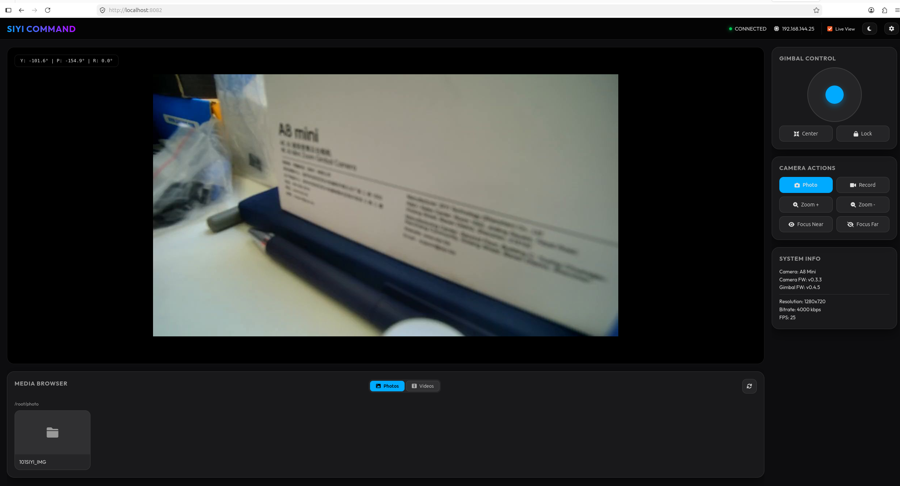

# SIYI SDK v2

[](https://github.com/mzahana/siyi_sdk/actions/workflows/ci.yml?query=branch%3Asiyi-sdk-v2)
[](https://codecov.io/gh/mzahana/siyi_sdk/tree/siyi-sdk-v2)
[](https://opensource.org/licenses/MIT)

Async Python SDK for the SIYI Gimbal Camera External SDK Protocol v0.1.1.

## Overview

The SIYI SDK provides a comprehensive, type-safe, and asyncio-native Python interface for controlling SIYI gimbal camera systems including ZT30, ZT6, ZR10, ZR30, A8 mini, A2 mini, and Quad-Spectrum products. It handles all low-level protocol details including frame serialization, CRC validation, and command sequencing, allowing developers to focus on gimbal control logic.

## Installation

### From Local Clone

Clone the repository and install in development mode:

```bash
git clone -b siyi-sdk-v2 https://github.com/mzahana/siyi_sdk.git
cd siyi_sdk
pip install -e .
```

### Installation with Extras

To install the SDK with specific functionality:

```bash
pip install -e ".[stream-opencv]"   # OpenCV backend (recommended)
pip install -e ".[stream-gst]"      # GStreamer backend (lower latency)
pip install -e ".[stream-aiortsp]"  # aiortsp + PyAV backend
pip install -e ".[web]"             # Web UI Dashboard
```

To install **all available extras** (streaming and web):

```bash
pip install -e ".[stream,stream-opencv,stream-gst,stream-aiortsp,web]"
```

## Quick Start

```python
import asyncio
from siyi_sdk import configure_logging, connect_udp

async def main() -> None:
    async with await connect_udp("192.168.144.25", 37260) as client:
        fw = await client.get_firmware_version()
        print(f"Camera FW: {fw.camera}, Gimbal FW: {fw.gimbal}, Zoom FW: {fw.zoom}")
        att = await client.get_gimbal_attitude()
        print(f"Yaw={att.yaw_deg:.1f}°  Pitch={att.pitch_deg:.1f}°  Roll={att.roll_deg:.1f}°")

configure_logging(level="INFO")   # human-readable output with log-level labels
asyncio.run(main())
```

Expected output:

```
10:07:33 [info     ] transport_connected            transport=UDPTransport
Camera FW: v3.2.1, Gimbal FW: v3.2.1, Zoom FW: v3.2.1
10:07:33 [info     ] rx_ack                         cmd_id=0x01 payload_len=12 seq=0
Yaw=0.0°  Pitch=0.0°  Roll=0.0°
10:07:33 [info     ] client_closed
```

See [docs/quickstart.md](docs/quickstart.md) for UDP, TCP, and Serial examples.

## Video Streaming

The SDK includes a `siyi_sdk.stream` sub-package for receiving live RTSP video from SIYI
cameras. It auto-selects the best available backend (GStreamer → aiortsp → OpenCV).

### Installation

Choose the backend that fits your needs:

| Backend | Install | System deps? | Latency |
|---------|---------|-------------|---------|
| **OpenCV** (recommended start) | `pip install "siyi-sdk[stream-opencv]"` | No | ~300–500 ms |
| **aiortsp + PyAV** | `pip install "siyi-sdk[stream-aiortsp]"` | No | ~200–400 ms |
| **GStreamer** | `pip install "siyi-sdk[stream-gst]"` + `apt install gstreamer1.0-*` | **Yes** | ~100–220 ms |

> GStreamer requires system packages that pip cannot install (e.g. `gstreamer1.0` libraries, as well as `libcairo2-dev` and `libgirepository1.0-dev` for building `PyGObject`). 
> A convenience shell script `install_gst_dependencies.sh` is provided in the root directory.
> See [docs/streaming.md § 8](docs/streaming.md) for platform-specific instructions.

### Quick Start

Ready-to-run streaming examples are available in the [examples/](examples/) directory:

- **[rtsp_opencv_new_gen.py](examples/rtsp_opencv_new_gen.py)** — Basic streaming for ZT30/ZT6/etc. (OpenCV).
- **[rtsp_gstreamer.py](examples/rtsp_gstreamer.py)** — Low-latency streaming using the GStreamer backend.
- **[rtsp_with_control.py](examples/rtsp_with_control.py)** — Control the gimbal and view the stream in one script.

For full documentation including old-gen vs new-gen URLs, reconnection behaviour, and
latency tuning, see [docs/streaming.md](docs/streaming.md).

## Web UI

The SDK includes a modern web-based control interface for the gimbal, camera, and SD card media.

### Features
- **Live Stream**: Low-latency MJPEG video proxy.
- **Gimbal**: Virtual joystick and real-time attitude display.
- **Camera**: Photo/Video control, Zoom, Focus, and Encoding settings.
- **Media**: Browse and download files from the TF card.

### Dashboard Preview



### Running the Web UI

1. Install web dependencies:
   ```bash
   pip install -e ".[web]"
   ```
2. Start the server:
   ```bash
   python -m web_ui.server
   ```
3. Open `http://localhost:8082` in your browser.

See **[docs/WEB_UI.md](docs/WEB_UI.md)** for detailed instructions.

## API Reference

The `SIYIClient` class provides ~80 public async methods for controlling the gimbal and camera. All methods are fully type-annotated and include comprehensive docstrings.

### System Commands

| Method | Parameters | Returns | Description |
|--------|-----------|---------|-------------|
| `heartbeat()` | — | `None` | Send keep-alive (TCP only). |
| `get_firmware_version()` | — | `FirmwareVersion` | Query firmware versions (camera, gimbal, zoom). |
| `get_hardware_id()` | — | `HardwareID` | Query hardware ID (SN, model). |
| `get_system_time()` | — | `SystemTime` | Query system time (Unix timestamp). |
| `set_utc_time(unix_usec: int)` | `unix_usec` | `bool` | Set system time. |
| `get_gimbal_system_info()` | — | `GimbalSystemInfo` | Query gimbal system info (pan limits, etc.). |
| `soft_reboot(*, camera: bool, gimbal: bool)` | `camera`, `gimbal` | `tuple[bool, bool]` | Reboot camera or gimbal. |
| `get_ip_config()` | — | `IPConfig` | Query IP configuration. |
| `set_ip_config(cfg: IPConfig)` | `cfg` | `None` | Set IP configuration. |

### Focus Commands

| Method | Parameters | Returns | Description |
|--------|-----------|---------|-------------|
| `auto_focus(touch_x: int, touch_y: int)` | `touch_x`, `touch_y` | `None` | Touch-to-focus at pixel (x, y). |
| `manual_zoom(direction: int)` | `direction` | `float` | Zoom in/out (±1). |
| `manual_focus(direction: int)` | `direction` | `None` | Focus in/out (±1). |
| `absolute_zoom(zoom: float)` | `zoom` | `None` | Set zoom magnification (1x–100x in 0.1x steps). |
| `get_zoom_range()` | — | `ZoomRange` | Query min/max zoom magnification. |
| `get_current_zoom()` | — | `float` | Query current zoom magnification. |

### Gimbal Control Commands

| Method | Parameters | Returns | Description |
|--------|-----------|---------|-------------|
| `rotate(yaw: int, pitch: int)` | `yaw`, `pitch` | `None` | Rotate gimbal (0.1° steps). |
| `one_key_centering(action: CenteringAction)` | `action` | `None` | Center gimbal (center/down/up). |
| `set_attitude(yaw_deg: float, pitch_deg: float)` | `yaw_deg`, `pitch_deg` | `SetAttitudeAck` | Move gimbal to target angles. |
| `set_single_axis(axis: int, target_angle: float, duration: float)` | `axis`, `target_angle`, `duration` | `None` | Move single gimbal axis. |
| `get_gimbal_mode()` | — | `GimbalMotionMode` | Query gimbal motion mode. |

### Attitude Commands

| Method | Parameters | Returns | Description |
|--------|-----------|---------|-------------|
| `get_gimbal_attitude()` | — | `GimbalAttitude` | Query gimbal attitude (yaw, pitch, roll, speeds). |
| `send_aircraft_attitude(att: AircraftAttitude)` | `att` | `None` | Send drone attitude (heading, pitch, roll). |
| `request_fc_stream(data_type: FCDataType, freq: DataStreamFreq)` | `data_type`, `freq` | `None` | Subscribe to FC data stream. |
| `request_gimbal_stream(data_type: GimbalDataType, freq: DataStreamFreq)` | `data_type`, `freq` | `None` | Subscribe to gimbal attitude stream. |
| `get_magnetic_encoder()` | — | `MagneticEncoderAngles` | Query magnetic encoder angles. |
| `send_raw_gps(gps: RawGPS)` | `gps` | `None` | Send GPS coordinates. |

### Camera Commands

| Method | Parameters | Returns | Description |
|--------|-----------|---------|-------------|
| `get_camera_system_info()` | — | `CameraSystemInfo` | Query camera system info (sensor, lens). |
| `capture(func: CaptureFuncType)` | `func` | `None` | Capture photo or record video. |
| `get_encoding_params(stream: StreamType)` | `stream` | `EncodingParams` | Query video encoding params. |
| `set_encoding_params(params: EncodingParams)` | `params` | `bool` | Set resolution, fps, bitrate. |
| `format_sd_card()` | — | `bool` | Erase SD card. |
| `get_picture_name_type(ft: FileType)` | `ft` | `FileNameType` | Query picture naming convention. |
| `set_picture_name_type(ft: FileType, nt: FileNameType)` | `ft`, `nt` | `None` | Set picture naming. |
| `get_osd_flag()` | — | `bool` | Query HDMI OSD flag. |
| `set_osd_flag(on: bool)` | `on` | `bool` | Enable/disable HDMI OSD. |

### Video Commands

| Method | Parameters | Returns | Description |
|--------|-----------|---------|-------------|
| `get_video_stitching_mode()` | — | `VideoStitchingMode` | Query video stitching mode. |
| `set_video_stitching_mode(mode: VideoStitchingMode)` | `mode` | `VideoStitchingMode` | Set video stitching (OFF/2x/3x/4x/6x). |

### Thermal Imaging Commands

| Method | Parameters | Returns | Description |
|--------|-----------|---------|-------------|
| `temp_at_point(x: int, y: int, flag: TempMeasureFlag)` | `x`, `y`, `flag` | `TempPoint` | Get spot temperature at pixel (x, y). |
| `temp_region(x1: int, y1: int, x2: int, y2: int, flag: TempMeasureFlag)` | `x1`, `y1`, `x2`, `y2`, `flag` | `TempRegion` | Get average temp in rectangular region. |
| `temp_global(flag: TempMeasureFlag)` | `flag` | `TempGlobal` | Get global min/max/avg temperature. |
| `get_pseudo_color()` | — | `PseudoColor` | Query pseudo-color mode. |
| `set_pseudo_color(c: PseudoColor)` | `c` | `PseudoColor` | Set pseudo-color (OFF/BW/IRON/JET/etc.). |
| `get_thermal_output_mode()` | — | `ThermalOutputMode` | Query thermal output mode. |
| `set_thermal_output_mode(m: ThermalOutputMode)` | `m` | `ThermalOutputMode` | Set thermal output (visible/thermal/fusion). |
| `get_single_temp_frame()` | — | `bool` | Query single temp frame mode. |
| `get_thermal_gain()` | — | `ThermalGain` | Query thermal gain (auto/mid/high). |
| `set_thermal_gain(g: ThermalGain)` | `g` | `ThermalGain` | Set thermal gain. |
| `get_env_correction_params()` | — | `EnvCorrectionParams` | Query environmental correction. |
| `set_env_correction_params(p: EnvCorrectionParams)` | `p` | `bool` | Set environmental correction. |
| `get_env_correction_switch()` | — | `bool` | Query thermal correction on/off. |
| `set_env_correction_switch(on: bool)` | `on` | `bool` | Enable/disable thermal correction. |
| `get_ir_thresh_map_state()` | — | `bool` | Query IR threshold mapping on/off. |
| `set_ir_thresh_map_state(on: bool)` | `on` | `bool` | Enable/disable IR threshold mapping. |
| `get_ir_thresh_params()` | — | `IRThreshParams` | Query IR threshold range. |
| `set_ir_thresh_params(p: IRThreshParams)` | `p` | `bool` | Set IR threshold range. |
| `get_ir_thresh_precision()` | — | `IRThreshPrecision` | Query IR threshold precision. |
| `set_ir_thresh_precision(p: IRThreshPrecision)` | `p` | `IRThreshPrecision` | Set IR threshold precision. |
| `manual_thermal_shutter()` | — | `bool` | Trigger manual thermal shutter. |

### Laser Commands

| Method | Parameters | Returns | Description |
|--------|-----------|---------|-------------|
| `get_laser_distance()` | — | `LaserDistance` | Query laser distance (meters). |
| `get_laser_target_latlon()` | — | `LaserTargetLatLon` | Query laser target lat/lon. |
| `set_laser_ranging_state(on: bool)` | `on` | `bool` | Enable/disable laser ranging. |

### Stream Subscriptions

| Method | Parameters | Returns | Description |
|--------|-----------|---------|-------------|
| `on_attitude(cb: Callable[[GimbalAttitude], None])` | `cb` | `Unsubscribe` | Subscribe to attitude push stream. |
| `on_laser_distance(cb: Callable[[LaserDistance], None])` | `cb` | `Unsubscribe` | Subscribe to laser distance stream. |
| `on_function_feedback(cb: Callable[[FunctionFeedback], None])` | `cb` | `Unsubscribe` | Subscribe to function feedback stream. |
| `on_ai_tracking(cb: Callable[[AITrackingTarget], None])` | `cb` | `Unsubscribe` | Subscribe to AI tracking stream. |

### RC and Debug Commands

| Method | Parameters | Returns | Description |
|--------|-----------|---------|-------------|
| `send_rc_channels(ch: RCChannels)` | `ch` | `None` | Send RC channels (18×2B). **Deprecated.** |
| `get_control_mode()` | — | `ControlMode` | Query control mode (follow/lock). |
| `get_weak_threshold()` | — | `WeakControlThreshold` | Query weak control threshold. |
| `set_weak_threshold(t: WeakControlThreshold)` | `t` | `bool` | Set weak control threshold. |
| `get_motor_voltage()` | — | `MotorVoltage` | Query motor voltage. |
| `get_weak_control_mode()` | — | `bool` | Query weak control mode. |
| `set_weak_control_mode(on: bool)` | `on` | `bool` | Enable/disable weak control. |

### AI Commands

| Method | Parameters | Returns | Description |
|--------|-----------|---------|-------------|
| `get_ai_mode()` | — | `bool` | Query AI tracking mode on/off. |
| `get_ai_stream_status()` | — | `AIStreamStatus` | Query AI tracking stream on/off. |
| `set_ai_stream_output(on: bool)` | `on` | `bool` | Enable/disable AI tracking stream. |

## Configuration

### Logging

Call `configure_logging()` once at the start of your script to set the output
format and verbosity:

```python
from siyi_sdk import configure_logging

configure_logging()                        # INFO level, human-readable (default)
configure_logging(level="DEBUG")           # show every frame TX/RX
configure_logging(level="WARNING")         # only problems
configure_logging(fmt="json")              # machine-readable JSON (log aggregators)
configure_logging(trace=True)              # DEBUG + hex-dump every payload
```

**Human-readable console output** (default, `fmt="console"`):

```
10:07:33 [info     ] transport_connected            transport=UDPTransport
10:07:33 [warning  ] timeout_retrying               attempt=1 cmd_id=0x0E delay_s=0.1
10:07:33 [error    ] timeout_exhausted              cmd_id=0x0E timeout_s=1.0
```

**JSON output** (`fmt="json"` — useful for pipelines and log aggregators):

```json
{"level": "info", "timestamp": "2026-04-22T10:07:33Z", "event": "transport_connected", "transport": "UDPTransport"}
```

### Environment Variables

Override logging settings without changing code:

| Variable | Values | Default | Description |
|----------|--------|---------|-------------|
| `SIYI_LOG_LEVEL` | `DEBUG` `INFO` `WARNING` `ERROR` | `INFO` | Log verbosity |
| `SIYI_LOG_FORMAT` | `console` `json` | `console` | Output format |
| `SIYI_PROTOCOL_TRACE` | `1` | — | Force DEBUG + hex-dump every frame payload |

```bash
SIYI_LOG_LEVEL=DEBUG python examples/set_attitude.py
SIYI_LOG_FORMAT=json python examples/udp_heartbeat.py
SIYI_PROTOCOL_TRACE=1 python examples/udp_heartbeat.py
```

## Examples

The `examples/` directory contains ready-to-run scripts for all major features:

### Core & Telemetry
- **[udp_heartbeat.py](examples/udp_heartbeat.py)** — Simple connection test and firmware query.
- **[system_info.py](examples/system_info.py)** — Detailed info about camera, gimbal, motor voltage, and IP config.
- **[subscribe_attitude_stream.py](examples/subscribe_attitude_stream.py)** — Subscribe to live attitude updates at a specific frequency.

### Gimbal Control
- **[set_attitude.py](examples/set_attitude.py)** — Move gimbal to absolute Euler angles.
- **[gimbal_rotation.py](examples/gimbal_rotation.py)** — Control rotation speed (yaw/pitch).
- **[gimbal_scan.py](examples/gimbal_scan.py)** — Automate a simple scanning pattern.
- **[attitude_control_loop.py](examples/attitude_control_loop.py)** — Example of a closed-loop control interface.

### Camera & Video
- **[rtsp_opencv_new_gen.py](examples/rtsp_opencv_new_gen.py)** — Live RTSP stream using OpenCV (ZT30/ZT6/etc.).
- **[rtsp_gstreamer.py](examples/rtsp_gstreamer.py)** — Low-latency stream using the GStreamer backend.
- **[rtsp_with_control.py](examples/rtsp_with_control.py)** — Full application: Move gimbal while viewing the stream.
- **[camera_capture.py](examples/camera_capture.py)** — Trigger photo capture and toggle video recording.
- **[zoom_control.py](examples/zoom_control.py)** — Absolute and manual zoom control.

### Advanced Features
- **[thermal_imaging.py](examples/thermal_imaging.py)** — Control thermal palettes, gain, and fusion modes.
- **[thermal_spot_temperature.py](examples/thermal_spot_temperature.py)** — Query spot temperature data.
- **[laser_ranging.py](examples/laser_ranging.py)** — Enable laser and poll target distance/coordinates.
- **[rtsp_record.py](examples/rtsp_record.py)** — Record the RTSP stream to a local MP4 file.

## Documentation

- **[docs/quickstart.md](docs/quickstart.md)** — UDP, TCP, and Serial connection examples.
- **[docs/protocol.md](docs/protocol.md)** — Wire-level protocol reference (frame structure, CRC, commands, timing, quirks).
- **[CONTRIBUTING.md](CONTRIBUTING.md)** — Development setup and contribution guidelines.
- **[CHANGELOG.md](CHANGELOG.md)** — Version history and release notes.

## Features

- **Async/await** — Full asyncio support for non-blocking I/O.
- **Type-safe** — 100% type-annotated with mypy strict compliance.
- **Protocol-complete** — 80+ commands covering system, focus, zoom, gimbal, attitude, camera, video, thermal, laser, and AI features.
- **Transport-agnostic** — UDP, TCP, Serial, and Mock transports.
- **Robust** — Automatic retry logic, per-command concurrency control, stream subscriptions.
- **Well-tested** — 500+ unit and integration tests with >90% coverage.
- **Documented** — Comprehensive API reference and protocol documentation.

## Development

### Setup

```bash
git clone https://github.com/mzahana/siyi-sdk.git
cd siyi-sdk
python -m venv venv
source venv/bin/activate  # or `venv\Scripts\activate` on Windows
pip install -e ".[stream-opencv,web]" # Includes common extras
```

### Testing

```bash
pytest tests/                       # Run all tests
pytest tests/ --cov=siyi_sdk        # With coverage report
pytest tests/ -k thermal            # Run thermal tests only
pytest -m hil                       # Run hardware-in-the-loop tests (requires SIYI_HIL=1)
```

### Linting and Type Checking

```bash
ruff check siyi_sdk tests           # Lint with ruff
ruff format siyi_sdk tests          # Format with ruff
mypy siyi_sdk --strict              # Type check
```

## License

This project is licensed under the MIT License — see the [LICENSE](LICENSE) file for details.

## Support

For issues, feature requests, or questions, please open an issue on [GitHub](https://github.com/mzahana/siyi-sdk/issues).
